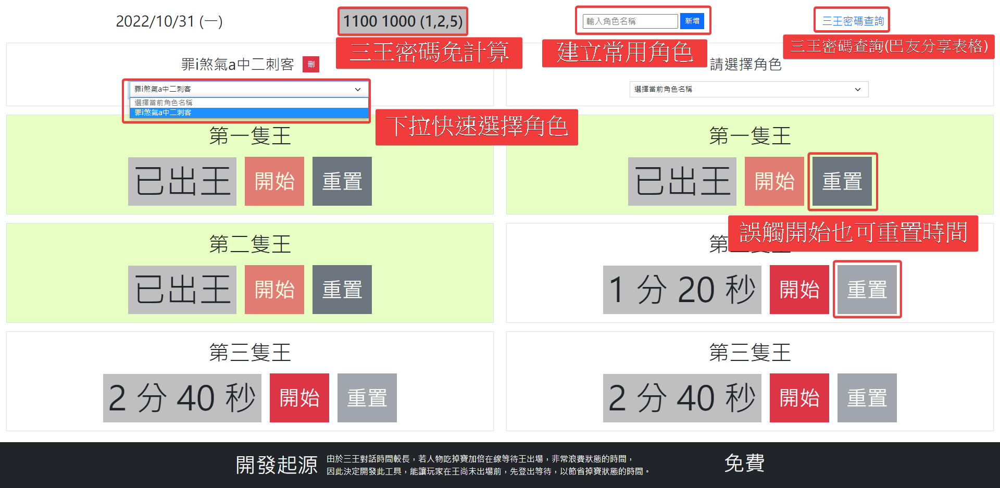

<h2>RO 三王 MVP 出現倒數計時</h2>

<h3>開發起源</h3>

由於三王對話時間較長，若人物吃掉寶加倍在線等待王出場，非常浪費狀態的時間，  
    因此決定開發此工具，能讓玩家在王尚未出場前，先登出等待，以節省掉寶狀態的時間。

<h3>功能陳列</h3>

<ul>
  <li>可以查看三王密碼(彈跳視窗)</li>
  <li>
    角色名稱
    <ul>
      <li>
        用戶可以新增常用的人物 ID ，以方便辨別該人物在第隻王的階段、王出場時間
      </li>
      <li>
        新增的人物會自動儲存在 localStorage 中，下次使用網頁，即可快速使用下拉選單選取
      </li>
      <li>
        可以刪除人物 ID
      </li>
    </ul>
  </li>
  <li>三次階段的區塊分開呈現</li>
  <li>按下開始即可倒數計時</li>
  <li>淡色系進度條，視覺化提示當前倒數進度</li>
  <li>重置按鈕可重置當前計時狀態</li>
  <li>按鈕皆有 Disabled 功能，點擊後即鎖定(防止多次點擊，導致倒數異常)</li>
  <li>計時結束後會有"門鈴音效"提示，即使瀏覽器不在此網頁，仍可得知王已經出了</li>
</ul>

<h3>使用說明</h3>

<ul>
  <li>可以填寫自己常用的人物 ID 並按下新增，下次使用此工具時，即可從下拉選單中快速選取</li>
  <li>當你進去三場觸發對話時，按下第一個階段的開始即可登出等待，時間到之後會有"門鈴聲"提醒你，王已經出場了</li>
  <li>打死第一隻王後，即可按下第二階段的開始，登出等待，一樣等待"門鈴聲" ~ 第二、三隻王也是一樣</li>
  <li>若不小心誤觸開始按紐，也可以按"重置"，就會重新計算時間了~</li>
  <li>會有淡色系的進度條背景，視覺化提醒你倒數的進度，當倒數完的同時，淡色背景已經填滿 ~ 能讓你快速知道已打過該階段了</li>
</ul>

<h3>預計開發</h3>

<ul>
  <li>
    計算各階段王出現的次數(整合 Google Sheet 表單)
    <ul>
      <li>
        在每個階段底下增加文字欄位、送出按紐
      </li>
      <li>
        只需輸入片段名字或暱稱，就出現下拉選單給予點擊 (例：大巴、87z、72...等)
      </li>
      <li>
        判斷用戶輸入的名字是否合法 (若資料庫無此 MVP 名稱，則回傳錯誤 [例：aaa])
      </li>
      <li>
        輸入名稱後，按下送出就會將資料傳到 Google Sheet 中記錄 (會計算是第幾階段出現、統計出現機率、次數)
      </li>
    </ul>
  </li>
  <li>
    (看使用者希望出現什麼功能...)
  </li>
</ul>

